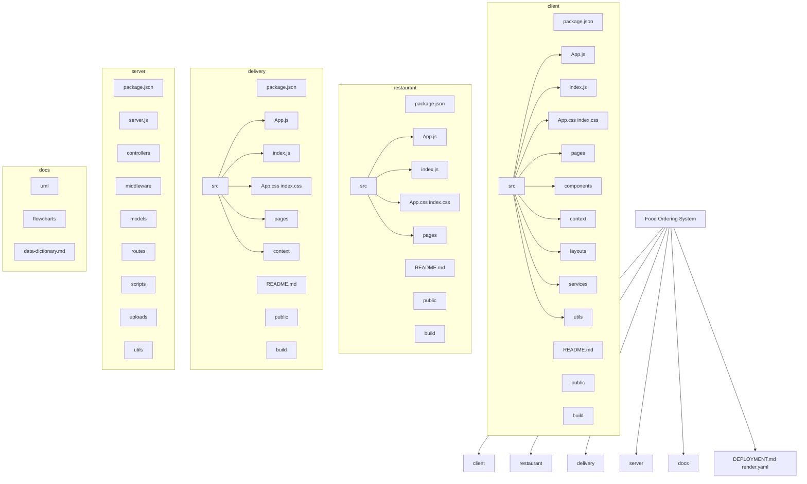

# Project Structure Flowchart

```mermaid
flowchart TB
    root[Food Ordering System]

    root --> client[client]
    root --> restaurant[restaurant]
    root --> delivery[delivery]
    root --> server[server]
    root --> docs[docs]
    root --> deployment[DEPLOYMENT.md render.yaml]

    subgraph clientGroup[client]
        clientPkg[package.json]
        clientReadme[README.md]
        clientPublic[public]
        clientBuild[build]
        clientSrc[src]

        clientSrc --> clientApp[App.js]
        clientSrc --> clientIndex[index.js]
        clientSrc --> clientStyles[App.css index.css]
        clientSrc --> clientPages[pages]
        clientSrc --> clientComponents[components]
        clientSrc --> clientContext[context]
        clientSrc --> clientLayouts[layouts]
        clientSrc --> clientServices[services]
        clientSrc --> clientUtils[utils]
    end

    subgraph restaurantGroup[restaurant]
        restaurantPkg[package.json]
        restaurantReadme[README.md]
        restaurantPublic[public]
        restaurantBuild[build]
        restaurantSrc[src]

        restaurantSrc --> restaurantApp[App.js]
        restaurantSrc --> restaurantIndex[index.js]
        restaurantSrc --> restaurantStyles[App.css index.css]
        restaurantSrc --> restaurantPages[pages]
    end

    subgraph deliveryGroup[delivery]
        deliveryPkg[package.json]
        deliveryReadme[README.md]
        deliveryPublic[public]
        deliveryBuild[build]
        deliverySrc[src]

        deliverySrc --> deliveryApp[App.js]
        deliverySrc --> deliveryIndex[index.js]
        deliverySrc --> deliveryStyles[App.css index.css]
        deliverySrc --> deliveryPages[pages]
        deliverySrc --> deliveryContext[context]
    end

    subgraph serverGroup[server]
        serverPkg[package.json]
        serverMain[server.js]
        serverControllers[controllers]
        serverMiddleware[middleware]
        serverModels[models]
        serverRoutes[routes]
        serverScripts[scripts]
        serverUploads[uploads]
        serverUtils[utils]
    end

    subgraph docsGroup[docs]
        umlDocs[uml]
        flowDocs[flowcharts]
        dataDictionary[data-dictionary.md]
    end
```