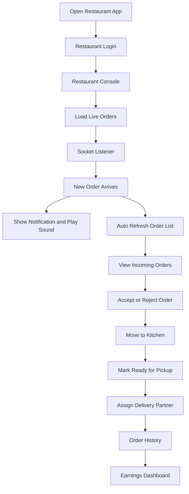

# Restaurant Main Flowchart

```mermaid
flowchart TD
    start[Open Restaurant App] --> login[Restaurant Login]
    login --> dashboard[Restaurant Console]
    dashboard --> load[Load Live Orders]
    load --> listen[Socket Listener]
    listen --> newOrder[New Order Arrives]
    newOrder --> alert[Show Notification and Play Sound]
    newOrder --> refresh[Auto Refresh Order List]
    refresh --> incoming[View Incoming Orders]
    incoming --> accept[Accept or Reject Order]
    accept --> kitchen[Move to Kitchen]
    kitchen --> ready[Mark Ready for Pickup]
    ready --> assign[Assign Delivery Partner]
    assign --> history[Order History]
    history --> earnings[Earnings Dashboard]
```