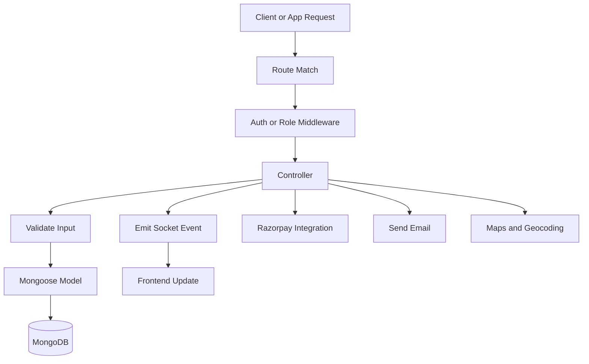

# Server Main Flowchart

```mermaid
flowchart TD
    request[Client or App Request] --> route[Route Match]
    route --> auth[Auth or Role Middleware]
    auth --> controller[Controller]
    controller --> validate[Validate Input]
    validate --> model[Mongoose Model]
    model --> db[(MongoDB)]
    controller --> socket[Emit Socket Event]
    controller --> payment[Razorpay Integration]
    controller --> email[Send Email]
    controller --> maps[Maps and Geocoding]
    socket --> client[Frontend Update]
```