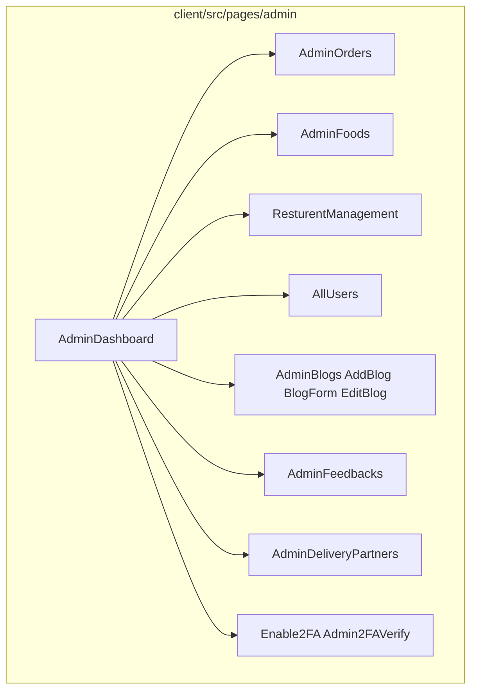
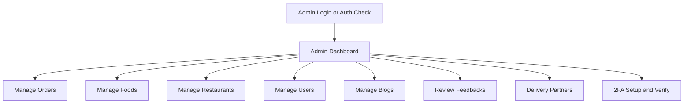

# Admin Panel UML

## Structure

```mermaid
flowchart TB
    subgraph admin[client/src/pages/admin]
        dashboard[AdminDashboard]
        orders[AdminOrders]
        foods[AdminFoods]
        restaurants[ResturentManagement]
        users[AllUsers]
        blogs[AdminBlogs AddBlog BlogForm EditBlog]
        feedbacks[AdminFeedbacks]
        partners[AdminDeliveryPartners]
        auth[Enable2FA Admin2FAVerify]
    end

    dashboard --> orders
    dashboard --> foods
    dashboard --> restaurants
    dashboard --> users
    dashboard --> blogs
    dashboard --> feedbacks
    dashboard --> partners
    dashboard --> auth
```

## Admin Flow

```mermaid
flowchart TD
    login[Admin Login or Auth Check] --> dashboard[Admin Dashboard]
    dashboard --> orders[Manage Orders]
    dashboard --> foods[Manage Foods]
    dashboard --> restaurants[Manage Restaurants]
    dashboard --> users[Manage Users]
    dashboard --> blogs[Manage Blogs]
    dashboard --> feedbacks[Review Feedbacks]
    dashboard --> partners[Delivery Partners]
    dashboard --> twofa[2FA Setup and Verify]
```