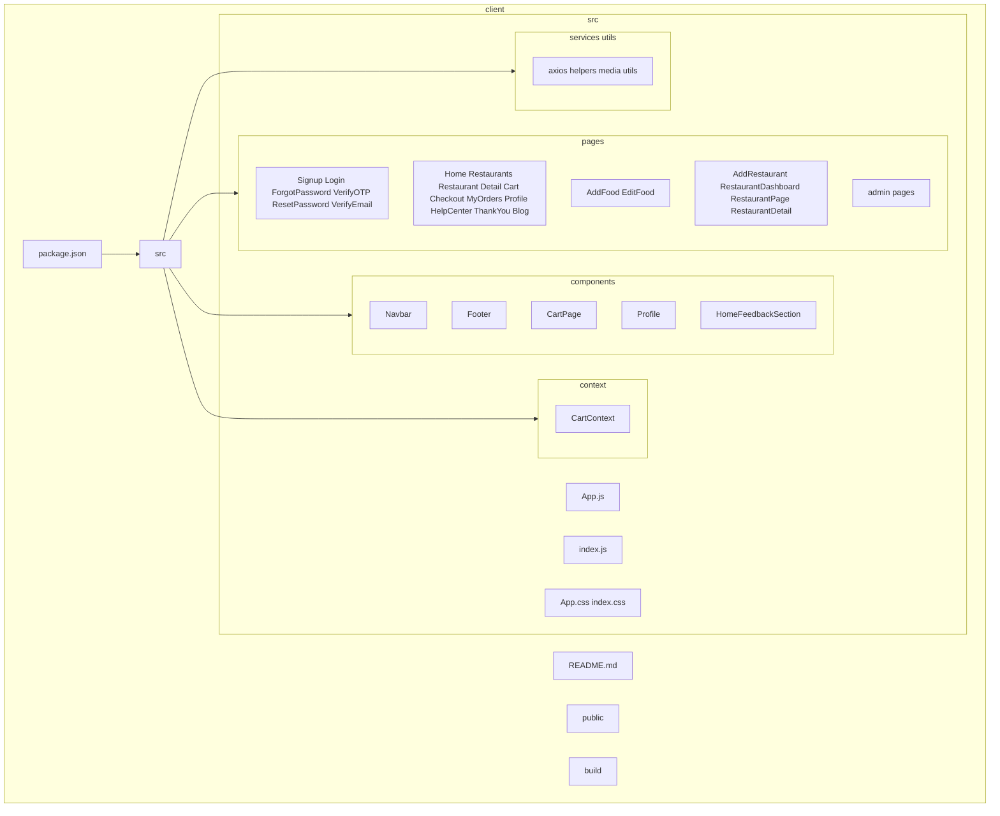
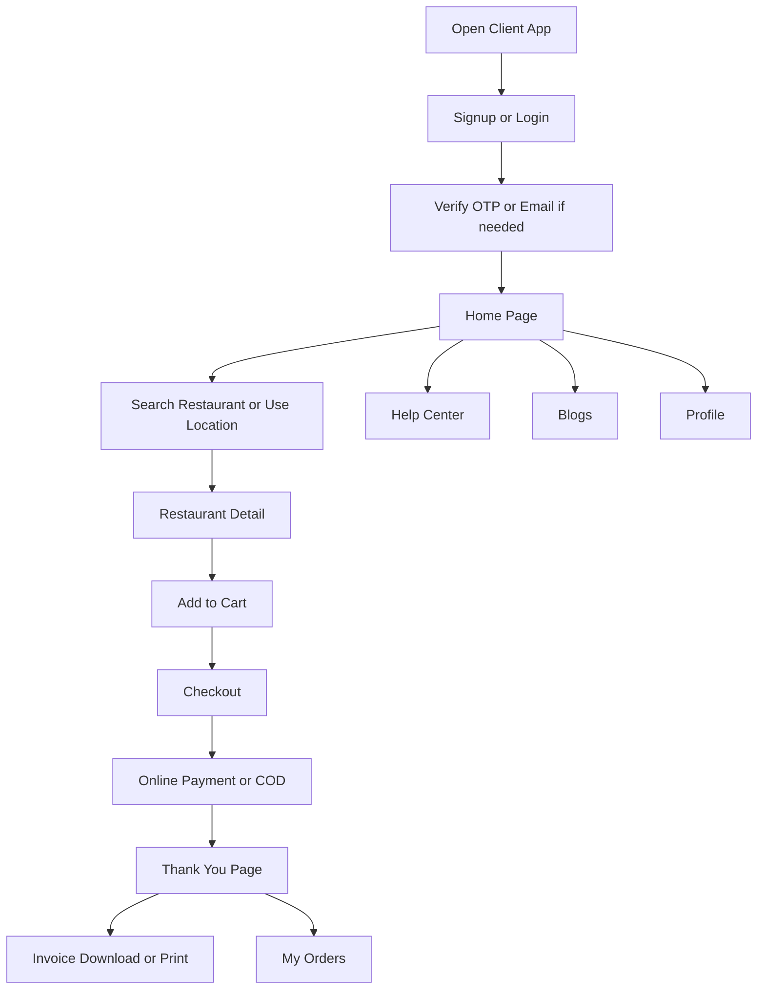

# Client UML

## Structure

```mermaid
flowchart TB
    subgraph client[client]
        pkg[package.json]
        readme[README.md]
        public[public]
        build[build]
        src[src]

        subgraph srcTree[src]
            appJs[App.js]
            indexJs[index.js]
            styles[App.css index.css]

            subgraph pages[pages]
                auth[Signup Login ForgotPassword VerifyOTP ResetPassword VerifyEmail]
                main[Home Restaurants Restaurant Detail Cart Checkout MyOrders Profile HelpCenter ThankYou Blog]
                food[AddFood EditFood]
                restaurant[AddRestaurant RestaurantDashboard RestaurantPage RestaurantDetail]
                admin[admin pages]
            end

            subgraph components[components]
                navbar[Navbar]
                footer[Footer]
                cartPage[CartPage]
                profile[Profile]
                feedback[HomeFeedbackSection]
            end

            subgraph context[context]
                cartContext[CartContext]
            end

            subgraph services[services utils]
                api[axios helpers media utils]
            end
        end
    end

    pkg --> src
    src --> pages
    src --> components
    src --> context
    src --> services
```

## Client Flow

```mermaid
flowchart TD
    start[Open Client App] --> signup[Signup or Login]
    signup --> otp[Verify OTP or Email if needed]
    otp --> home[Home Page]
    home --> search[Search Restaurant or Use Location]
    search --> detail[Restaurant Detail]
    detail --> cart[Add to Cart]
    cart --> checkout[Checkout]
    checkout --> payment[Online Payment or COD]
    payment --> success[Thank You Page]
    success --> invoice[Invoice Download or Print]
    success --> orders[My Orders]
    home --> help[Help Center]
    home --> blogs[Blogs]
    home --> profile[Profile]
```