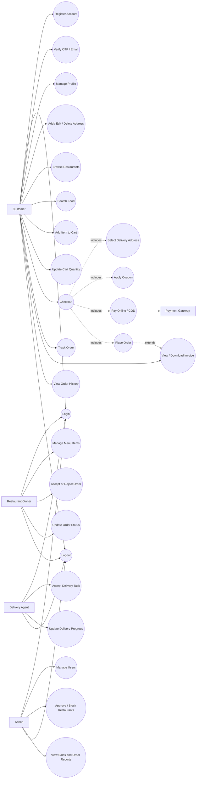
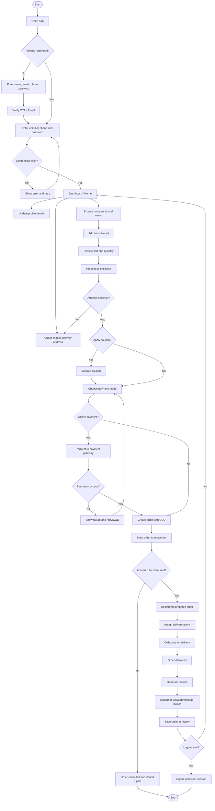
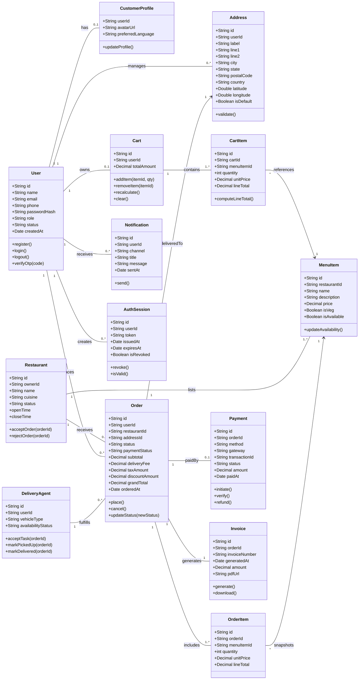

# Complete System UML (Use Case + Activity + Class)

Is file me food ordering system ke 3 detailed UML diagrams diye gaye hain:
1. Use Case Diagram
2. Activity Diagram
3. Class Diagram

## 1) Use Case Diagram

## 2) Activity Diagram

## 3) Class Diagram
