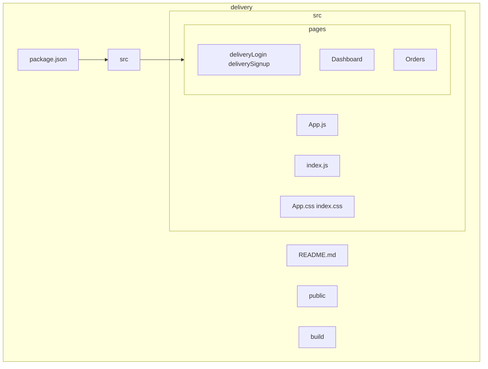
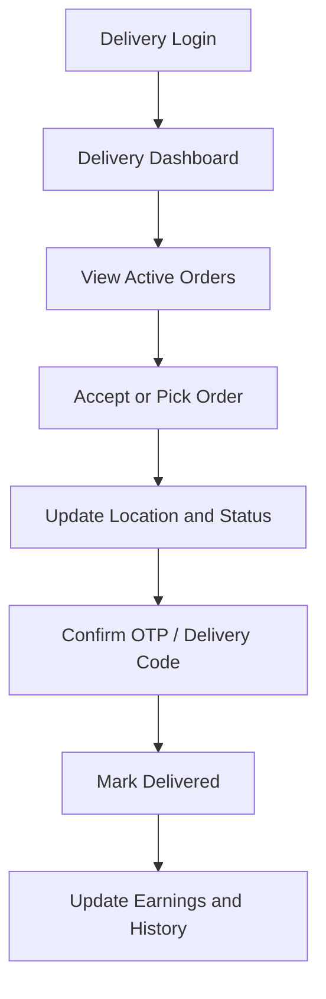

# Delivery UML

## Structure

```mermaid
flowchart TB
    subgraph delivery[delivery]
        pkg[package.json]
        readme[README.md]
        public[public]
        build[build]
        src[src]

        subgraph srcTree[src]
            appJs[App.js]
            indexJs[index.js]
            styles[App.css index.css]

            subgraph pages[pages]
                auth[deliveryLogin deliverySignup]
                dashboard[Dashboard]
                orders[Orders]
            end
        end
    end

    pkg --> src
    src --> pages
```

## Delivery Flow

```mermaid
flowchart TD
    login[Delivery Login] --> dashboard[Delivery Dashboard]
    dashboard --> active[View Active Orders]
    active --> accept[Accept or Pick Order]
    accept --> track[Update Location and Status]
    track --> otp[Confirm OTP / Delivery Code]
    otp --> delivered[Mark Delivered]
    delivered --> earnings[Update Earnings and History]
```