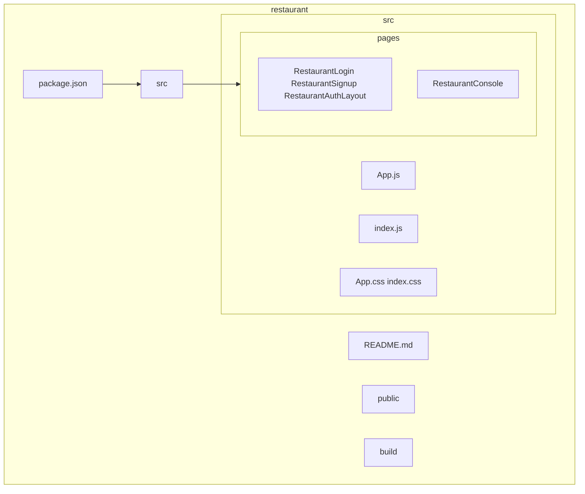
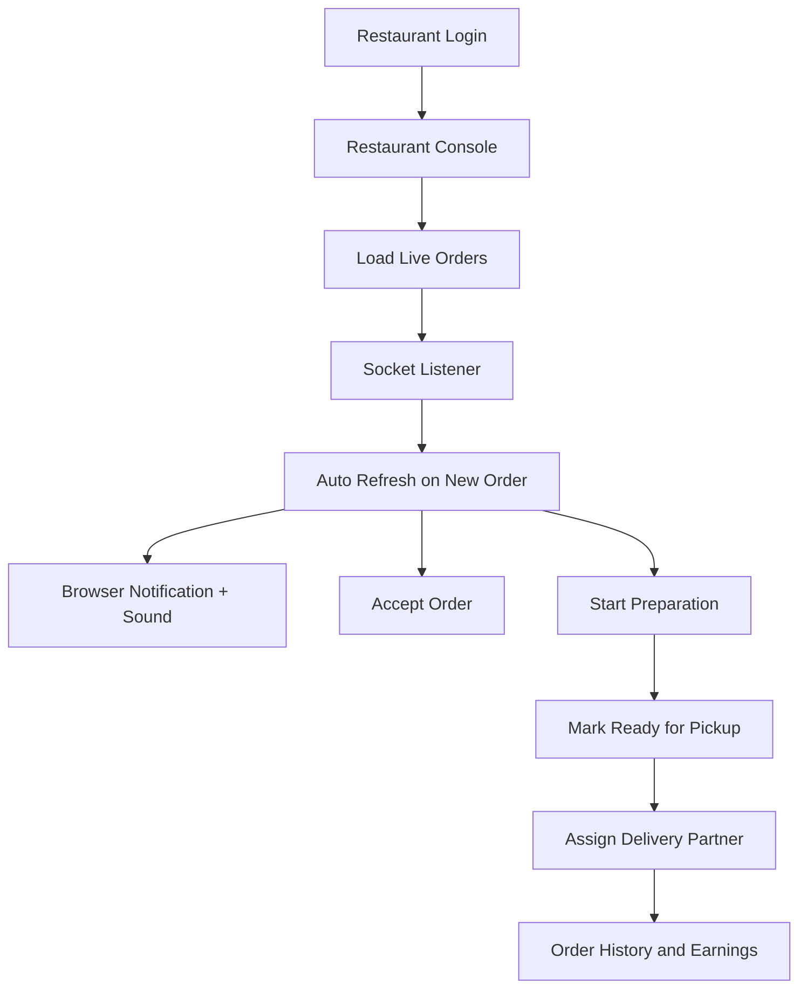

# Restaurant UML

## Structure

```mermaid
flowchart TB
    subgraph restaurant[restaurant]
        pkg[package.json]
        readme[README.md]
        public[public]
        build[build]
        src[src]

        subgraph srcTree[src]
            appJs[App.js]
            indexJs[index.js]
            styles[App.css index.css]

            subgraph pages[pages]
                auth[RestaurantLogin RestaurantSignup RestaurantAuthLayout]
                console[RestaurantConsole]
            end
        end
    end

    pkg --> src
    src --> pages
```

## Restaurant Flow

```mermaid
flowchart TD
    login[Restaurant Login] --> dashboard[Restaurant Console]
    dashboard --> load[Load Live Orders]
    load --> socket[Socket Listener]
    socket --> refresh[Auto Refresh on New Order]
    refresh --> notify[Browser Notification + Sound]
    refresh --> accept[Accept Order]
    refresh --> prepare[Start Preparation]
    prepare --> ready[Mark Ready for Pickup]
    ready --> assign[Assign Delivery Partner]
    assign --> history[Order History and Earnings]
```