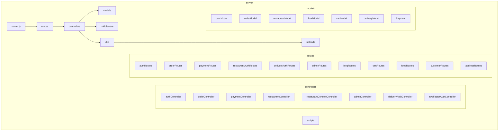
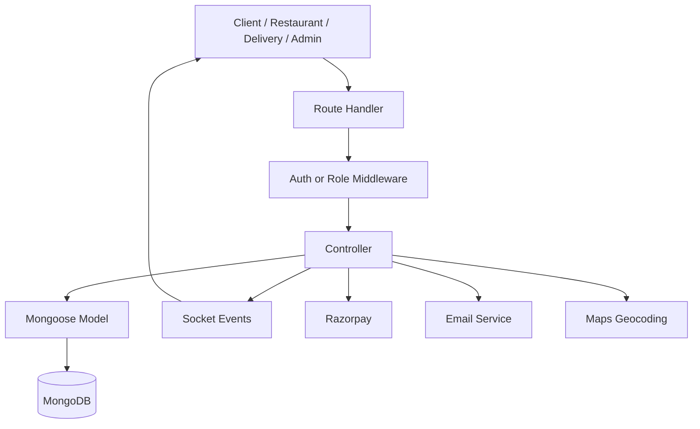

# Server UML

## Structure

```mermaid
flowchart TB
    subgraph server[server]
        serverJs[server.js]
        controllers[controllers]
        routes[routes]
        models[models]
        middleware[middleware]
        utils[utils]
        scripts[scripts]
        uploads[uploads]

        subgraph controllersTree[controllers]
            authController[authController]
            orderController[orderController]
            paymentController[paymentController]
            restaurantController[restaurantController]
            restaurantConsoleController[restaurantConsoleController]
            adminController[adminController]
            deliveryAuthController[deliveryAuthController]
            twoFactorAuthController[twoFactorAuthController]
        end

        subgraph routesTree[routes]
            authRoutes[authRoutes]
            orderRoutes[orderRoutes]
            paymentRoutes[paymentRoutes]
            restaurantAuthRoutes[restaurantAuthRoutes]
            deliveryAuthRoutes[deliveryAuthRoutes]
            adminRoutes[adminRoutes]
            blogRoutes[blogRoutes]
            cartRoutes[cartRoutes]
            foodRoutes[foodRoutes]
            customerRoutes[customerRoutes]
            addressRoutes[addressRoutes]
        end

        subgraph modelsTree[models]
            userModel[userModel]
            orderModel[orderModel]
            restaurantModel[restaurantModel]
            foodModel[foodModel]
            cartModel[cartModel]
            deliveryModel[deliveryModel]
            paymentModel[Payment]
        end
    end

    serverJs --> routes
    routes --> controllers
    controllers --> models
    controllers --> middleware
    controllers --> utils
    utils --> uploads
```

## Server Request Flow

```mermaid
flowchart TD
    client[Client / Restaurant / Delivery / Admin] --> route[Route Handler]
    route --> auth[Auth or Role Middleware]
    auth --> controller[Controller]
    controller --> model[Mongoose Model]
    model --> db[(MongoDB)]
    controller --> socket[Socket Events]
    controller --> payment[Razorpay]
    controller --> mail[Email Service]
    controller --> maps[Maps Geocoding]
    socket --> client
```